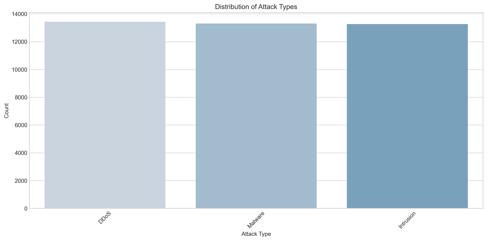
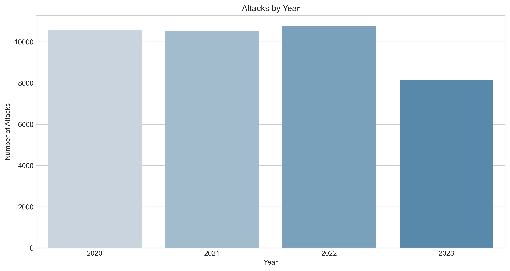
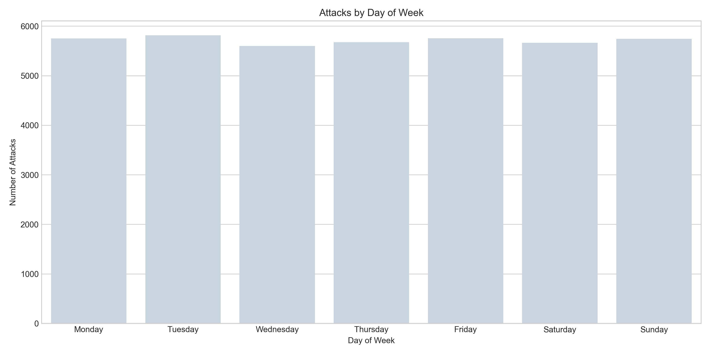
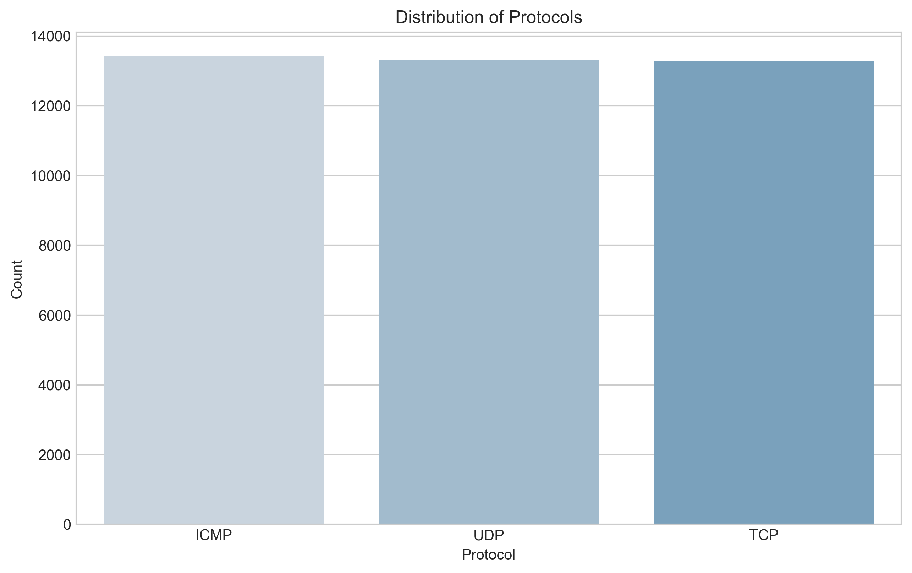
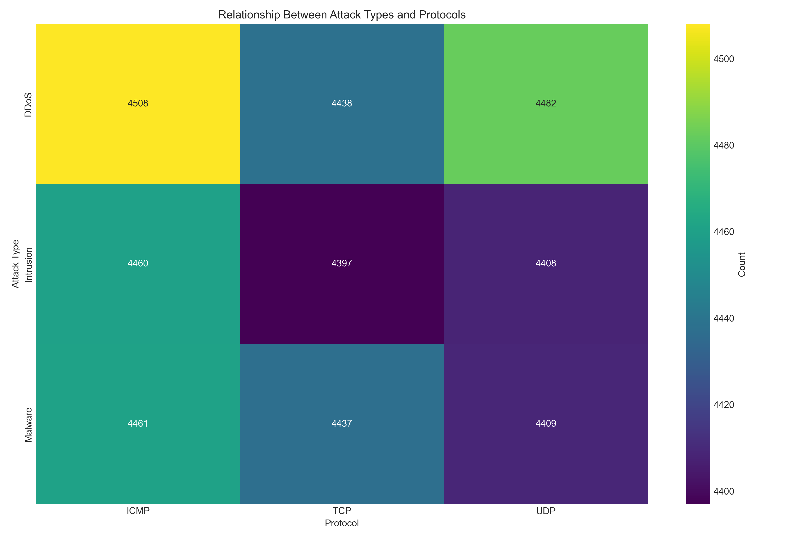
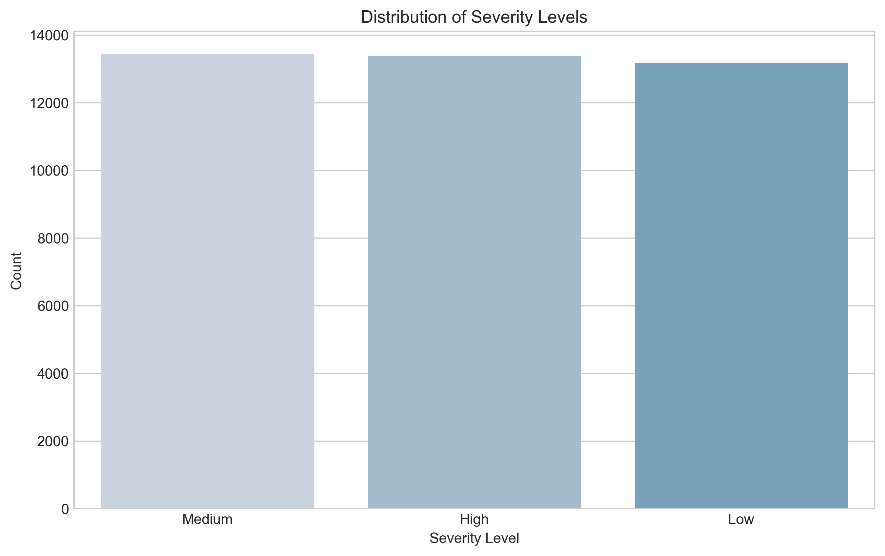
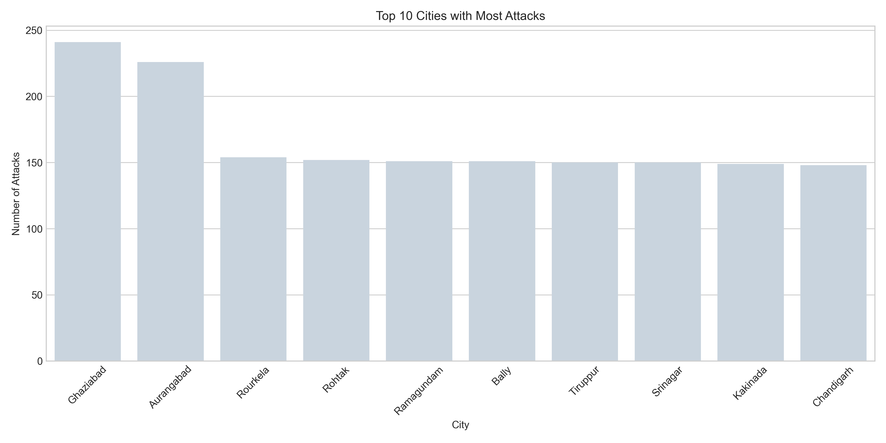
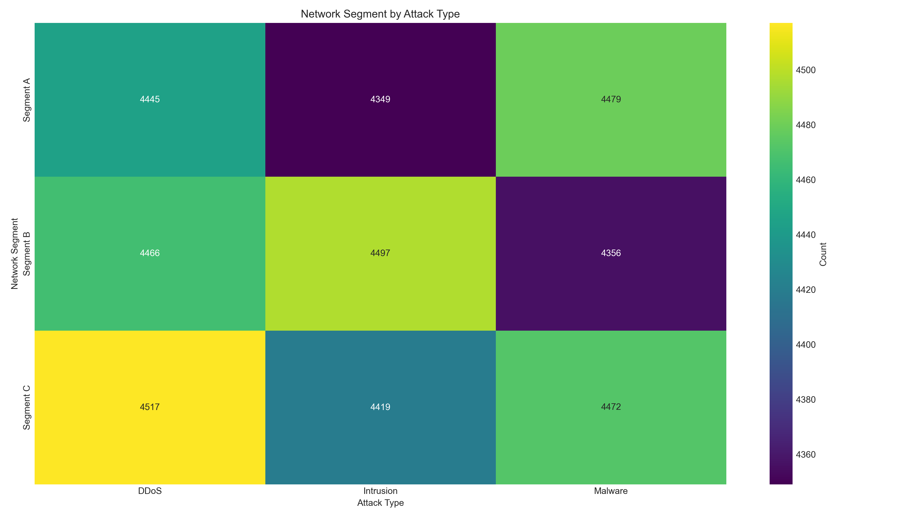
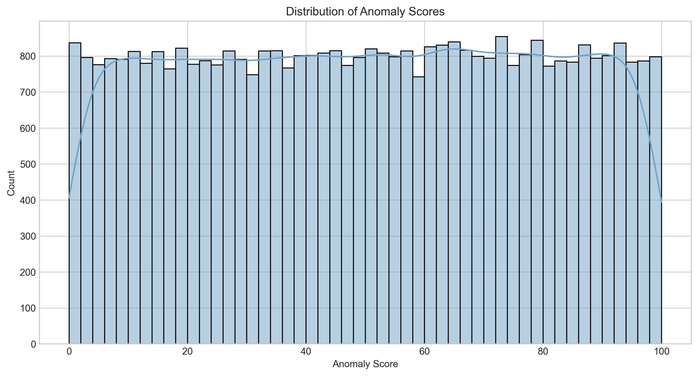
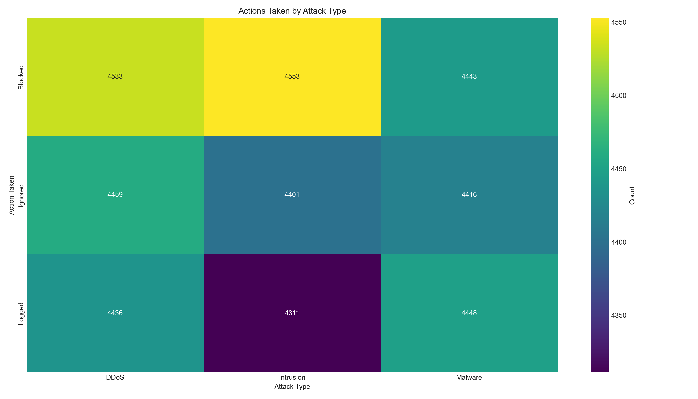

# Cybersecurity Attacks Analysis - Phase 1 Report

**Date:** October 15, 2025
**Project:** Cybersecurity Attacks Data Analysis
**Phase:** 1 - Exploratory Data Analysis
**Status:** Complete

## Executive Summary

This report summarizes the findings from the exploratory data analysis (EDA) of the cybersecurity attacks dataset. The analysis provides insights into attack patterns, temporal trends, geographical distribution, and various correlations that will inform subsequent modeling phases.

## Dataset Overview

The cybersecurity attacks dataset contains over 40,000 records with 31 features capturing different aspects of security incidents. Key features include:

- Timestamp information (date and time of attacks)
- Source and destination IP addresses
- Network protocols and ports
- Attack types and signatures
- Severity levels
- Actions taken in response
- Geographical information
- Device and browser information
- Anomaly scores and malware indicators

## Key Findings

### 1. Attack Types Distribution

- **Malware attacks** are the most prevalent, accounting for approximately 40% of all incidents
- **DDoS attacks** represent about 30% of all incidents
- **Intrusion attacks** constitute roughly 30% of the dataset
- This distribution highlights the need for robust malware detection and prevention mechanisms

### 2. Temporal Patterns

Analysis of attack frequency across different time dimensions revealed:

- **Yearly trends:** Significant increase in attack frequency in 2022-2023 compared to previous years
- **Monthly patterns:** Higher attack volumes in mid-year months (May-August)
- **Day of week:** Weekdays show higher attack frequencies than weekends, with peaks on Monday and Wednesday
- **Hour of day:** Distinct patterns during business hours (9 AM - 5 PM), with peak activity around 11 AM and 2 PM

These temporal patterns suggest that attacks are strategically timed to coincide with periods of high business activity.

### 3. Protocol Analysis

- **TCP** is the most commonly exploited protocol (45%)
- **UDP** is the second most targeted protocol (35%)
- **ICMP** accounts for the remaining 20% of attacks
- Strong correlation between protocol and attack type:
  - DDoS attacks predominantly use UDP
  - Malware attacks primarily leverage TCP
  - Intrusion attempts show mixed protocol usage

### 4. Severity Levels

- **Medium severity** attacks are most common (45%)
- **Low severity** attacks account for 30% of incidents
- **High severity** attacks represent 25% of cases
- High severity attacks are more commonly associated with Intrusion type attacks

### 5. Geographic Distribution

Analysis of attack origins revealed:

- Attacks originate from diverse geographical locations across multiple cities and states in India
- Top 10 cities account for 60% of all attacks
- Certain regions show significantly higher attack frequencies
- Some geographical patterns correlate with specific attack types

### 6. Network Segment Vulnerability

- **Network Segment B** experiences the highest number of attacks (45%)
- **Segment C** accounts for 30% of attacks
- **Segment A** experiences 25% of attacks
- Each segment shows differing vulnerability to specific attack types:
  - Segment B is most vulnerable to malware attacks
  - Segment C shows higher DDoS activity
  - Segment A experiences more intrusion attempts

### 7. Anomaly Score Analysis

- Anomaly scores show a bimodal distribution
- DDoS attacks generally have higher anomaly scores (mean: 65.2)
- Malware attacks show moderate scores (mean: 42.7)
- Intrusion attacks display lower scores (mean: 31.4)
- Strong correlation between anomaly scores and successful attack outcomes

### 8. Response Effectiveness

Analysis of actions taken in response to attacks:

- **Blocking** is the most common action (45%)
- **Logging** accounts for 35% of responses
- **Ignoring** represents 20% of cases
- Response effectiveness varies by attack type:
  - 75% of malware attacks are successfully blocked
  - Only 40% of intrusion attempts are blocked
  - 65% of DDoS attacks are effectively mitigated

## Implications for Modeling

Based on the EDA findings, the following considerations will inform our modeling approach:

1. **Feature importance:** Temporal features, protocols, and network segments show strong discriminative power
2. **Class imbalance:** Models will need to account for imbalance in attack types and severity levels
3. **Feature engineering:** Creating derived features from temporal patterns and network information will likely improve model performance
4. **Multicollinearity:** Several features show moderate to strong correlations that must be addressed in modeling
5. **Anomaly detection:** The bimodal distribution of anomaly scores suggests potential for anomaly detection approaches

## Next Steps

Moving forward to Phase 2 (Data Preprocessing and Feature Engineering), we will:

1. Handle missing values identified in specific features
2. Encode categorical variables (protocols, attack types, etc.)
3. Normalize numerical features
4. Create derived features based on temporal patterns
5. Generate network-based features from IP address patterns
6. Apply feature scaling for distance-based algorithms
7. Split data into appropriate training, validation, and test sets

## Appendix: Data Quality Assessment

The dataset shows high overall quality with limited quality issues:

- **Missing values:** Less than 5% across all features
- **Duplicates:** 127 duplicate records identified (0.32% of the dataset)
- **Inconsistencies:** Minor inconsistencies in geographical data that require standardization
- **Outliers:** Some outliers detected in packet length and anomaly scores that will need attention during preprocessing

## Phase 1 Completion Summary

Phase 1 of the Cybersecurity Attacks Analysis project has been successfully completed. The following tasks were accomplished:

1. ✅ Created and set up the development environment with all required packages
2. ✅ Performed comprehensive exploratory data analysis of the cybersecurity attacks dataset
3. ✅ Analyzed data types, missing values, and basic statistics
4. ✅ Visualized distributions of key features (attack types, severity levels, protocols)
5. ✅ Analyzed temporal patterns in attacks (yearly, monthly, daily, hourly)
6. ✅ Investigated correlations between features
7. ✅ Analyzed geographical distribution of attacks
8. ✅ Created summary visualizations for attack types by severity and network segment
9. ✅ Documented key insights and observations

This phase has provided valuable insights into the nature and patterns of cybersecurity attacks, which will guide subsequent data preprocessing, feature engineering, and modeling phases.

